<h1 align="center">Embra Ads Assistant</h1>

[Find the deployed project here](https://dennisschenkel.github.io/PP2/)

The Embra Ads Assistant is a tool that helps companies HR department in their effort to reach talents to generate applications and fill open positions with them. The tool helps to find the right platform to place advertising and allocate budget to gain the best results.

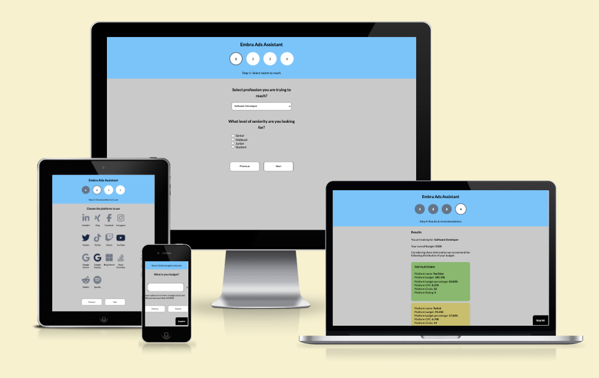

## Table of Contents

* [User Experience](#user-experience-ux)
  * [User Stories](#user-stories)

* [Design](#design)
  * [Color Scheme](#color-scheme)
  * [Typography](#typography)
  * [Wireframes](#wireframes)

* [Features](#features)
  * [Frontend Features](#frontend-features)
  * [Logic Features](#logic-features)
  * [Technical Features](#technical-features)
  * [Accessibility](#accessibility)

* [Technologies Used](#technologies-used)
  * [Languages Used](#languages-used)
  * [Frameworks, Libraries & Programs Used](#frameworks-libraries--programs-used)

* [Deployment](#deployment)

* [Testing](#testing)
  * [Validator Testing](#validator-testing)
  * [Lighthouse Testing](#lighthouse-testing)
  * [Manual Testing](#manual-testing)
  * [Kown And Unfixed Bugs](#known--unfixed-bugs)
  * [Learnings](#learnings)
  * [Possible Improvements](#possible-improvements)

* [Credits](#credits)
  * [Content](#content)
  * [Media](#media)
  * [Acknowledgments](#acknowledgments)

* [Appendix](#appendix)
  * [Data Used](#data-used)

## User Experience (UX)

### User Stories

When it comes to users of the Embra Ads Assistent, most likely the users will be Marketing Managers, HR Managers or Employer Branding Managers.

Users as defined above are regularly trying to reach people that match their criteria as talent suitable to fill an open position at their company. To reach this goal, they create ads for a variety of platforms and run them against a then to be defined target audience on the individual platform. But a lot of time, the platform is not the best choice for reaching the desired audience. Maybe a small part of the target audience is present on the platform, but the cost for reaching them would be much more expensive and inefficient, than it would be on a different platform. So for the users, it is important to get good information about what platform to use to best reach the target audience intended.

These users can have one or multiple of the following goals when using the Embra Ads Assist.

- **Find the right platforms to use from their disposal**  
The users are led through the process and are asked to fill in all relevant information about the profession they try to fill an open position for, the platforms to use and the budget. At step two, they are asked to select all platforms, their company is already using to reach potential applicants. Users have to select a minimum of one platform at that step. After the definition of the budget to use, the user is led to the final results, that gives them more information. On the result page, the users can see what platforms of the selected ones are the best capable of reaching the desired target audience. It also shows, how much of the overall budget should be allocated to each platform. In case none of the selected platforms is a platform best suited to reaching the target audience, the assistant gives a recommendation for other platforms that would be very good to use.

- **Allocate budgets to platforms best fitting**  
Similar to the first user scenario, users who are looking to best allocate their budget to specific platforms, are led through the process and are asked to fill in all the information. After going through the three steps where they have to fill in this information, the fourth step shows the results. Here the users can see, where they should allocate their budget to on the one hand reach the right target audience and on the other hand spread the budget on a reasonable range of different platforms, to not be reliant on just one single platform.

- **Find new platforms to use**  
Users that are looking for the best platforms to use, also have to fill in all the information. Although they might not already use a lot of platforms, they can just select all provided platforms and then in the results see, which one they should be using. If they already use some platforms and have only selected these, depending on the selected platforms, some more platforms to use will be recommended in the results, if these platforms better than everything that was selected by the users. In that way, the users find new platforms to use to reach their goals.

## Design

Since the focus of the tool is in its functionality, the design is very minimalistic and without images, videos or any special design elements.

- To keep it simple, the tool is designed with a width of 350px and does not need any media queries for the mist devices.
- From a device width of 350px and down to 280px the media queries are set.

### Color Scheme

The color scheme for the tool is simple and provide a sufficient contrast. More colors are used on the final result page.
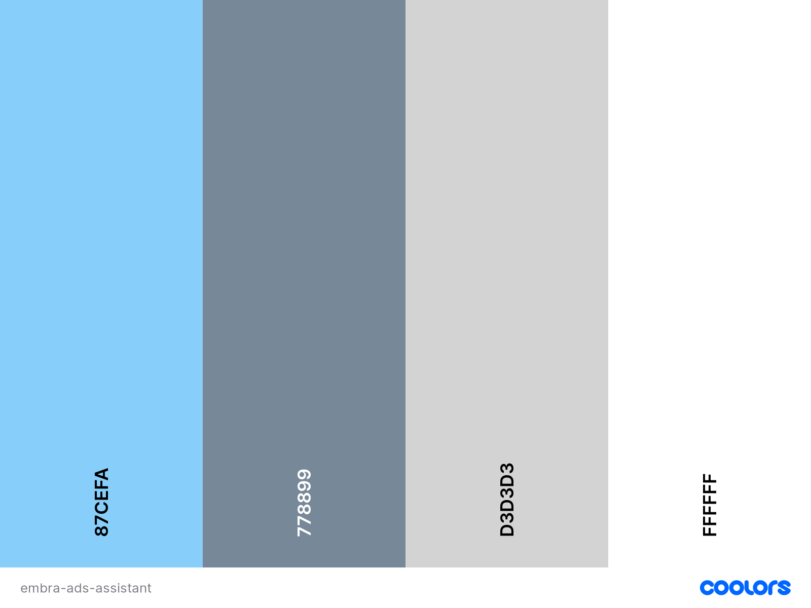

The colors used on the final result page 
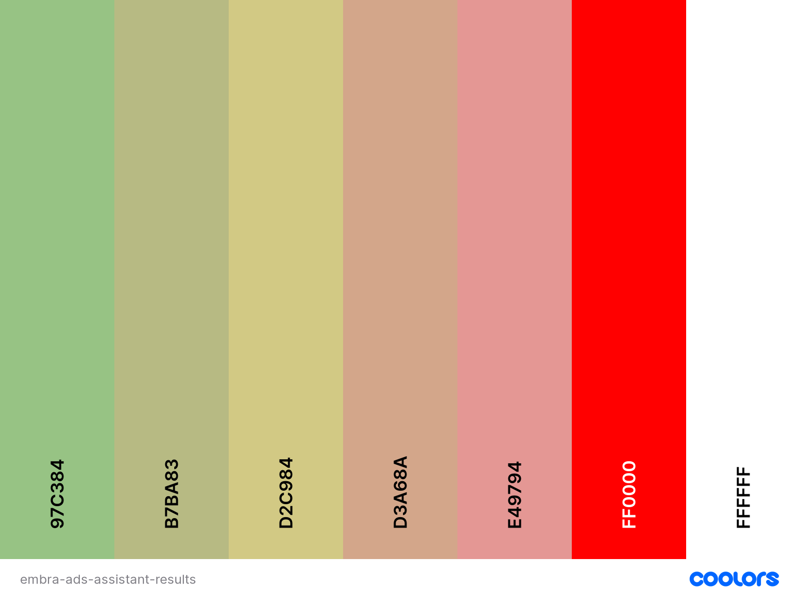

### Typography

For the Embra Ads Assistant primarily the font Lato.

- Lato offers a clean and easy to read style and at the same time not to common.

Weights used are:
- H1, H2, H3: 600

### Wireframes

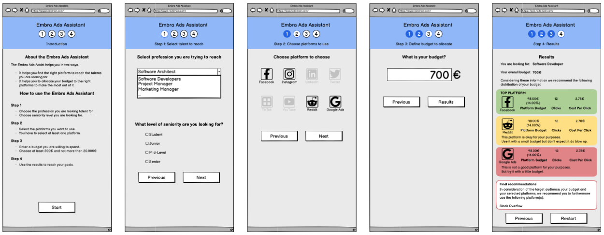
Wireframes for each step of the process the programm leads through.

## Features

### Frontend Features

- **Process flow in header**
    
    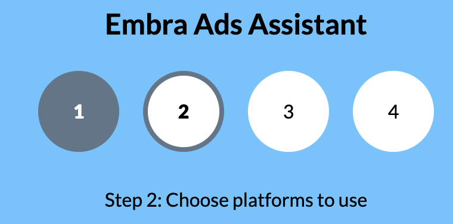
    
    - The steps in the header change depending on the active step
    - Steps also change when going back to a previous step

- **Navigation**
    - On the front page is only one button to start the process.
    - On all steps within the process, the user has two buttons to use.
        - Next step
        - Previous step
    - On the final result page, the "Next step" button is called "Restart" and redirects to the index.html
    - On the right side of the footer on every page is a link to the imprint.html

- **Step 1: Profession selection**
    
    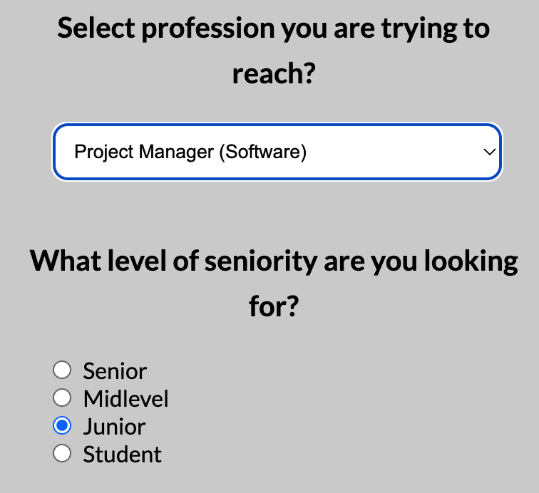
    
    - The profession of the target group can be selected by using a dropdown menu
    - The level of seniority has to be chosen by using one of four radio buttons
        - If no seniority level was selected, an alert is triggered and proceeding is not possible until one was selected

- **Step 2: Platform selection**

    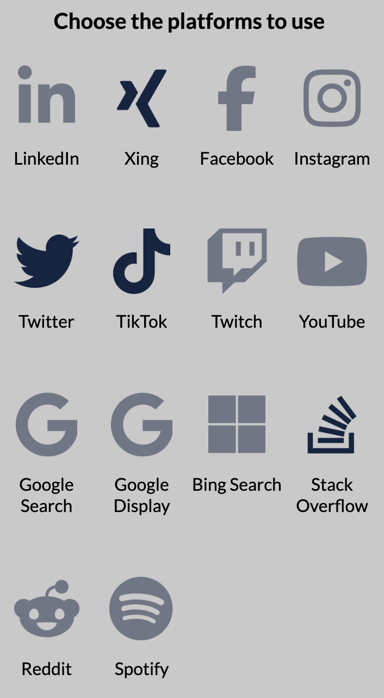

    - Logos change color when hovering over them
        - Done by changing the opacity since the image has a color itself
    - When selected, the color changes permanently
        - Done by changing the opacity since the image has a color itself
    - Logos can be deselected and change back their color.
    - At least one platform has to be selected. Otherwise, an alert is triggered and proceeding is not possible until one or more platforms have been selected

- **Step 3: Budget selection**

    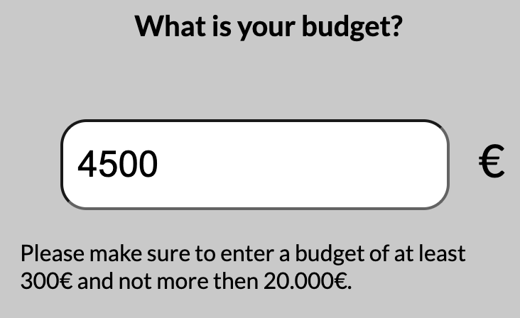

    - Budget has to be within a reasonable range of a min. of 300€ and a max. of 20.000€
    - If the chosen budget is not within that range, an alert is triggered when trying to go to the next step

- **Step 4: Results**

    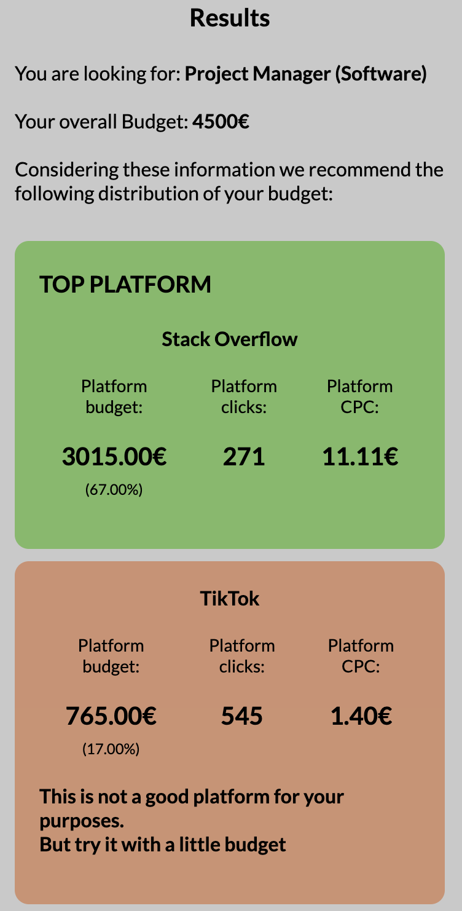

    - Results are ordered by the most fitting platform at the top and going down in quality of the match.
    - Each platform has an allocated absolute budget and a percentage of the absolute budget.
    - Each platform result shows the calculated clicks that are to expect for the budget.
    - Platforms are divided into 5 ranks, depending on the quality of the match. The ranks are:
        - Top platform
        - Second best platform
        - Okay platforms
        - Not good platforms
        - Don't use platforms

    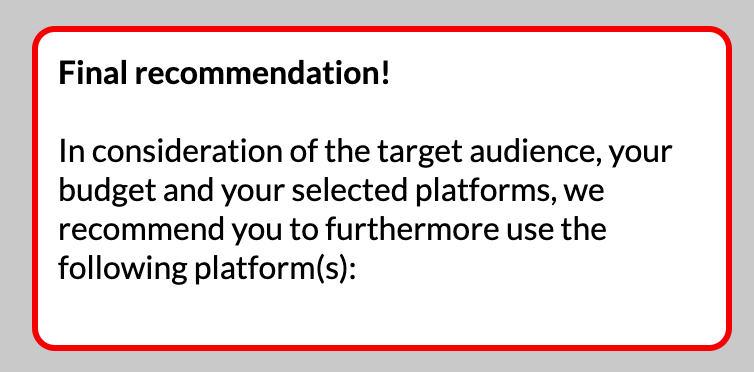

    - If none of the top platforms for the chosen profession has been selected by the user, on the button of the page will appear a recommendation for what additional top platform to use beside the already selected ones.

- **Imprint page**
    - Only as placeholder for later

### Logic Features

**Multipliers and average Cost per Click**
- Six professions can be selected and more can be added by editing the separate JS file.
- Each profession has four levels of seniority that can be selected, each with a seniority multiplier assigned to it.
- Every profession has a demand multiplier assigned that indicated the demand for talent of this profession in the market.
- The sum of demand and seniority multiplier is later multiplied with the average platform Cost per Click (CPC) to demonstrate rising costs with higher seniority and more demanded talent.

**Platform rating and budget allocation**
- Every profession has a rating for every platform (0 to 5). This indicates how good the platform can be used to reach talent of this profession (5 is the best).
- The platform rating is later used to calculate the percentage of budget that is allocated to the platform.
- To calculate the percentage of the budget for each platform, the total amount of rating points of all platforms are summed up and the percentage of each selected platform of this total is the percentage of the budget allocation.

**Cost per Click and amount of clicks**
- With the average CPC (Cost per Click) of each platform and the multipliers, each platform gets a unique calculated CPC for the selected profession at a selected seniority level.
- The allocated budget is then divided by the CPC of the platform and the amount of clicks is calculated and rounded to a full number.

**Platform recommendation**
- Platforms are recommended by the rating for the selected profession.
- Recommendations are ordered top to bottom from best to worse.
- If no platform with the best rating of 5 was selected, at the end of the recommendation list comes an additional recommendation with the platforms best suited for reaching the selected profession (rating of 5).

### Technical Features

- Import of JS files as data source for easy update, so that even none technical users can update it without having to enter the complete code or a database.
- List of platforms and the logos are dynamically created using information from the JS file
- Logos of platforms are implemented as images and not with FontAwesome for data privacy reasons.
- All input fields are checking for required input and trigger an alarm if not correctly filled out.

### Accessibility

To garantee a good accessibility, to the following aspects have been payed attention:

- Use of Semantic HTML on all pages.
- Aria-Labels added to all links and buttons.
- When choosing the colors I aimed for a sufficiant contrast.

## Technologies Used

For creating this website, the following technologies have been used.

### Languages Used

Languages used are the following:
- HTML
- CSS
- JavaScript

### Frameworks, Libraries & Programs Used

- [Visual Studio Code](https://code.visualstudio.com/) - As IDE
- [GitHub](https://github.com/) - As host for the repository and to deploy the website to make the preview visible to visitors
- [Git](https://git-scm.com/) - Used as integrated feature in Visual Studio Code for version control in combination with GitHub
- [Google Fonts](https://fonts.google.com/) - To import the 'Lato' font
- [Font Awesome](https://fontawesome.com/) - Icons for the platform selection and results. FontAwesome was not integrated by using JavaScript, but by downloading in icon files and uploading them to the images directory.

- [Balsamiq](https://balsamiq.com/) - For wireframes
- [Adobe](https://www.adobe.com/de/products/illustrator.html) Illustrator - For editing the FontAwesome icons.
- [ui.dev](https://ui.dev/amiresponsive) - For generating the Mockup
- [coolors](https://coolors.co/) - For generating the color sheme visualisation
- [Lighthouse](https://chromewebstore.google.com/detail/lighthouse/blipmdconlkpinefehnmjammfjpmpbjk) - For performance and accessibility testing

## Deployment

This page is deployed on GitHub pages.
The process of deploying the website are as followed:
- When logged in to GitHub, the 'Settings' navigation item is to find in the top navigation bar. This has to selected.
- On the then opening page is a navigation bar on the left side. Here choose 'Pages'.
- In the now opening settings page the  following settings have to be made.
- In the dropdown menu choose 'Deploy from branch'.
- In the first dropdown below choose 'main'.
- In the second dropdown choose '/root'.
- After saving these settings, the page is deployed.
- GitHub needs a few seconds and after refreshing the page a button to the deployed page is displayed in the top with 'Visit site' on it.

[Find the deployed project here](https://dennisschenkel.github.io/PP2/)

## Testing

### Validator Testing

#### HTML:

W3C HTML validation for the index.html site:

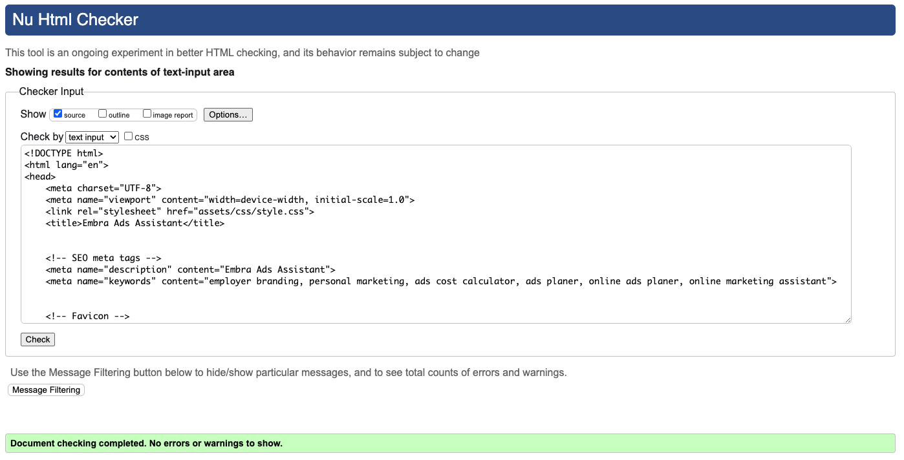

W3C HTML validation for the imprint.html site:

- No errors could be found by the W3C validator.

##### CSS:

Jigsaw CSS validation for the styles.css

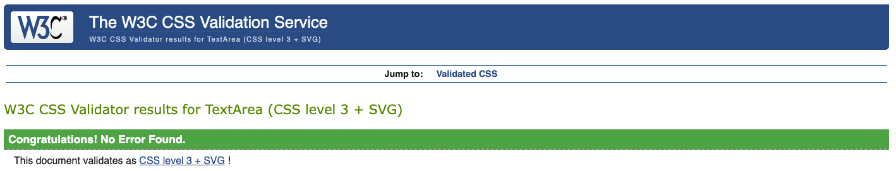

- No errors could be found by the Jigsaw validator.

#### JavaScrips:

JSHint validation for the script.hs

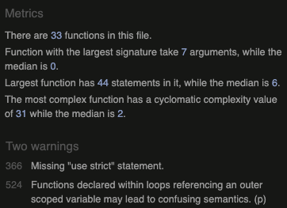

- JSHints shows a total of 2 warnings. None of them are errors and prevent the code from working as planned.
- When first testing, the JSHint showed multiple warnings that have been fixed.

- After a first validation, multiple missing semicolons were added, and unnecessary semicolons have been deleted.
- Multiple "use strict" statements were added as recommended by JSHint.
- One "use strict" is missing as mentioned by JSHint, but when added, it leads to a different warning. So it was not added.
- On multiple for loops additional if statements with .hasOwnProperty(i) have been added as recommended by JSHint.
- In one case, a function declared within a loop is referencing to an outer scoped variable, which may led to confusion regarding the semantics.
- 14 warnings were associated with the initial import of the two JSON files, because this is only possible with a limited amount of browsers.

### Lighthouse Testing

Lighthouse test results for the index.html

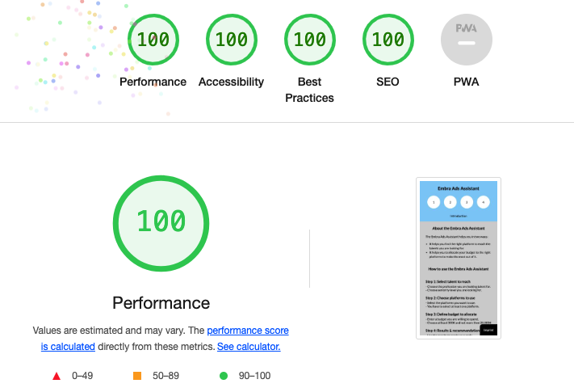

Since Lighthouse only test the front page with the standard test, I did snapshot test for all the other steps.

Snapshot test for the start page

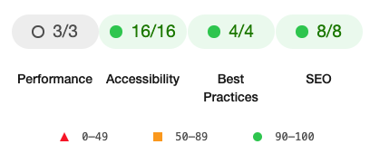

Snapshot test for step 1

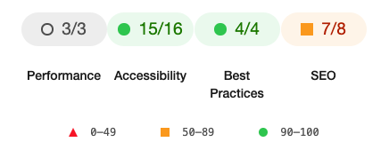

Snapshot test for step 2

Snapshot test for step 3

Snapshot test for step 4

### Manual testing

| **Test** | **Description** | **Expected Outcome** | **Result** |
| --- | --- | --- | --- |
| **Start** |  |  |  |
| Start navigation start | Click on the start button in the start page | Changing HTML to display the step 1 of the process. | Pass |
| **Step 1** |  |  |  |
| Profession selection | Select profession from dropdown | Each profession in the dropdown is selectable. | Pass |
| Seniority selection | Select seniority from radio buttons | Each seniority is selectable. Former selected seniority elements are no longer selected. | Pass |
| Navigation next| Click on the next button at the bottom | Changing HTML to display the step 2 of the process. | Pass |
| Navigation previous | Click on the previous button at the bottom | Going to the index.html and loading it completely new. | Pass |
| Input validation | Validating if a seniority level was selected | When going to step 2 and no seniority level was selected, an alert is triggered and shown in the top. Proceeding to the next step is not possible without a valid input. | Pass |
| **Step 2** |  |  |  |
| Platform hovering effect | Platform icons show a hovering effect when a mouse hovers over them. | Icons show hover effect and get a darker color as long as the mouse stays on them. | Pass |
| Platform selection | Select platforms from list of platforms | When clicking on a platform icon, the selected icon permanently gets a darker color. | Pass |
| Platform deselection | Deselect platforms from list of platforms | When clicking on an already selected icon, this icon no longer permanently in a darker color. Hover effect can now happen again. | Pass |
| Responsiveness - Logo grid | Change of the display of the logos on a resolution of 350px and lower | When having a resolution of 350px or lower, all logos are displayed in a grid with three columns instead of four. | Pass |
| Navigation next| Click on the next button at the bottom | Changing HTML to display the step 3 of the process. | Pass |
| Navigation previous | Click on the previous button at the bottom | Changing HTML to display the step 1 of the process. | Pass |
| Input validation | Validating if at least one platform was selected | When going to step 3 and no platform was selected, an alert is triggered and shown in the top. Proceeding to the next step is not possible without a valid input. | Pass |
| **Step 3** |  |  |  |
| Budget definition | Define budget to allocate | The input field can be used to enter a number but no non-numeric characters. | Pass |
| Navigation next| Click on the next button at the bottom | Changing HTML to display the step 4 of the process. | Pass |
| Navigation previous | Click on the previous button at the bottom | Changing HTML to display the step 2 of the process. | Pass |
| Input validation 1 | Validating if a valid budget of 300€ or more was entered | When going to step 4 and a budget lower than 300€ was defined, an alert is triggered and shown in the top. Proceeding to the next step is not possible without a valid input. | Pass |
| Input validation 2 | Validating if a valid budget over 20.000€ or less was entered | When going to step 4 and a budget of more than 20.000€ was defined, an alert is triggered and shown in the top. Proceeding to the next step is not possible without a valid input. | Pass |
| **Step 4** |  |  |  |
| Result list | Selected platforms are ordered in a logical order and information are understandable | Selected platforms are ordered from good to bad when it comes to achieving the user's goals. Budget, percentage, clicks and CPC is calculated and displayed correctly. | Pass |
| Final recommendation | Depending on the selected platforms a final recommendation is shown | When only bad platforms for the profession have been selected, the best platforms for the selected profession is displayed at the bottom of the result list. | Pass |
| Navigation previous | Click on the previous button at the bottom | Changing HTML to display the step 3 of the process. | Pass |
| Navigation restart | Click on the restart button at the bottom | Going to the index.html and loading it completely new. | Pass |
| **Header Step Indicator** |  |  |  |
| Step 1 circle active | Mark circle step indicator as active | The first of the white circles in the header gets a dark-colored border. | Pass |
| Step 1 text active  | Change text of step indicator in header | Text in header changes to "Step 1: Select talent to reach". | Pass |
| Step 1 circle done  | Mark circle step indicator as done | When going to step 2 the bordered circle of step 1 gets filled out and the number gets white. | Pass |
| Step 1 circle back  | Change of circle step indicator in header | When going back to the start page from step 1, the bordered circle of step 1 gets back to white again and all circles are completely white. | Pass |
| Step 1 text back  | Change text of step indicator in header | Text in header changes back to "Start". | Pass |
| Step 2 circle active | Mark circle step indicator as active | The second of the white circles in the header gets a dark-colored border. | Pass |
| Step 2 text active | Change text of step indicator in header | Text in header changes to "Step 2: Choose platforms to use". | Pass |
| Step 2 circle done  | Mark circle step indicator as done | When going to step 3 the bordered circle of step 2 gets filled out and the number gets white. | Pass |
| Step 2 circle back  | Change of circle step indicator in header | When going back to step 1 from step 2, the bordered circle of step 2 gets back to white again and the circle of step 1 is no longer filled out but only with the border again. Former white number of the now active gets black again. | Pass |
| Step 2 text back  | Change text of step indicator in header | Text in header changes back to "Step 1: Select talent to reach". | Pass |
| Step 3 circle active | Mark circle step indicator as active | The third of the white circles in the header gets a dark-colored border. | Pass |
| Step 3 text active | Change text of step indicator in header | Text in header changes to "Step 3: Define budget to allocate". | Pass |
| Step 3 circle done  | Mark circle step indicator as done | When going to step 4 the bordered circle of step 3 gets filled out and the number gets white. | Pass |
| Step 3 circle back  | Change of circle step indicator in header | When going back to step 2 from step 3, the bordered circle of step 3 gets back to white again and the circle of step 2 is no longer filled out but only with the border again. Former white number of the now active gets black again. | Pass |
| Step 3 text back  | Change text of step indicator in header | Text in header changes back to "Step 2: Choose platforms to use". | Pass |
| Step 4 circle active | Mark circle step indicator as active | The fourth of the white circles in the header gets a dark-colored border. | Pass |
| Step 4 text active | Change text of step indicator in header | Text in header changes to "Step 4: Results & recommendations". | Pass |
| Step 4 circle back  | Change of circle step indicator in header | When going back to step 3 from step 4, the bordered circle of step 4 gets back to white again and the circle of step 3 is no longer filled out but only with the border again. Former white number of the now active gets black again. | Pass |
| Step 4 text back  | Change text of step indicator in header | Text in header changes back to "Step 3: Define budget to allocate". | Pass |
| **Footer** |  |  |  |
| Responsiveness - Footer imprint element | Check for responsiveness of footer element | Footer element with imprint link should always be located at the bottom right of the page and stay in this position when window size is changed. | Pass |
| Footer Imprint Link | Click on the logo in footer | Loading of the imprint.html in the same tab. | Pass |

### Known & Unfixed Bugs

- No errors have been found, that would qualify as bugs.

### Learnings

- At the start of the project, I went with importing the professions and platform data from JSON files. Close to the end of the project, with the support of Kay, I learned that only the Chrome Browser is capable of using the JSON import. 
To resolve this problem, I changed the JSON files to JS files and created objects in them, that previously have been the JSON file. On the bottom comes an export statement and in the main JS file comes the import of the JS files instead of the JSON files. The changes were made in just a few minutes.

### Possible Improvements

- For a real world project, I would prefer to have a selection of multiple professions with a text input field.
- With consideration of time and scope for this project, I decided to go with the selection of only one profession with a dropdown.
- For improved navigation, I would add keydown eventListener for enter and delete for going to the next step (enter) or going a step back (delete).
- When going one step back, the former selected information are deleted from the array and they have to be put in again.
    - In a next version I would implement a feature, that the former selected values are still selected, even when going back and forth between steps
- I worked with arrays, and the indexing in each array has to be consistently the same to the selected platform. That can potentially lead to problems.
    - In a new version of the application, I would try working with more objects instead of so many arrays.
- From my understanding of the concept of memory leaks, the way I use eventListeners on buttons to go back and forth between steps, could lead to a browser crash, when the memory heap gets full. This would only happen after many thousand times of going back and forth, but should be fixed in a new version.

## Credits

### Content

- All content was written and created by Dennis Schenkel.

###  Media

- The platform icons have been downloaded from FontAwesome and edited with Adobe Illustrator.
- No further images or videos were used.

###  Acknowledgments

- Thanks to Gareth McGirr for providing great mentorship as part of the Code Academy course.
- Thanks to Kay for they effort and support for solving the JSON issue and checking back with the rest of the Code Institute team.
- Thanks to the community for the awesome weekly calls and exchange.

## Appendix

### Used data

#### Professions.JS

For this project, the following professions and related data were added as data with the integration of a separate professions.js file.

##### Profession Data

- Platform Rating - A rating from 0 to 5 for as how well each platform is suitable to reach each profession
- Demand Multiplier - A multiplier that indicates how strong the demand for talents with that profession is
- Seniority Multiplier - A multiplier that indicates how much more expensive it is to reach each seniority level

##### Professions

- Software Developer
- Software Engineer
- Project Manager (Software)
- Marketing Manager
- Sales Manager
- HR Manager

##### Seniority Levels

For each profession, the following four seniority levels are available.

- Senior
- Midlevel
- Junior
- Student

#### Platforms.JS

For this project, the following platforms and related data were added as data with the integration of a separate platforms.js file.

##### Platforms Data

- Name - Name of the platform
- Average Cost Per Click (CPC) - The average cost for each click on an ad at each platform
- Relative link to platform icon - Link to the icons on the webserver for automatically loading the platforms grid

##### Platforms Added

- LinkedIn
- Xing
- Facebook
- Instagram
- Twitter
- TikTok
- YouTube
- Twitch
- Google Search
- Google Display
- Bing Search
- StackOverflow
- Reddit
- Spotify

##### Platform Rating

- Perfect (Value 5)
- Great (Value 4)
- Good (Value 2)
- Okay (Value 1)
- Bad (Value 0)