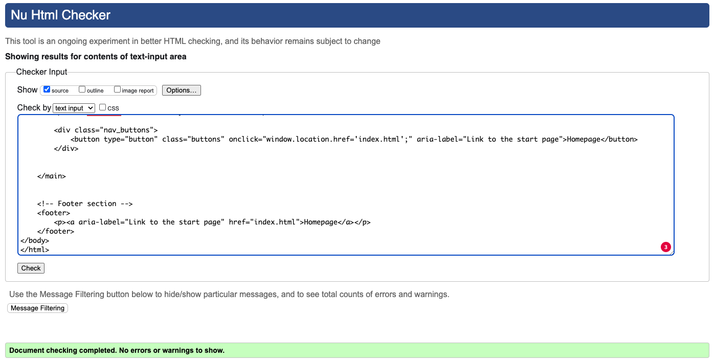

<h1 align="center">Embra Ads Assistant</h1>

[Find the deployed project here](https://dennisschenkel.github.io/PP2/)

The Embra Ads Assistant is a tool that helps companies HR department in their effort to reach talents to generate applications and fill open positions with them. The tool helps to find the right platform to place advertising and allocate budget to gain the best results.

## Table of Contents

## User Experience (UX)

### User Stories

When it comes to users of the Embra Ads Assistent, most likely the users will be Marketing Managers, HR Managers or Employer Branding Managers.

Users as defined above are regularly trying to reach people that match their criteria as talent suitable to fill an open position at their company. To reach this goal, they create ads for a variety of platforms and run them against a then to be defined target audience on the individual platform. But a lot of time, the platform is not the best choice for reaching the desired audience. Maybe a small part of the target audience is present on the platform, but the cost for reaching them would be much more expensive and inefficient, than it would be on a different platform. So for the users, it is important to get good information about what platform to use to best reach the target audience intended.

These users can have one or multiple of the following goals when using the Embra Ads Assist.

- **Find the right platforms to use from their disposal**  
The users are led through the process and are asked to fill in all relevant information about the profession they try to fill an open position for, the platforms to use and the budget. At step two, they are asked to select all platforms, their company is already using to reach potential applicants. Users have to select a minimum of one platform at that step. After the definition of the budget to use, the user is led to the final results, that gives them more information. On the result page, the users can see what platforms of the selected ones are the best capable of reaching the desired target audience. It also shows, how much of the overall budget should be allocated to each platform. In case none of the selected platforms is a platform best suited to reaching the target audience, the assistant gives a recommendation for other platforms that would be very good to use.

- **Allocate budgets to platforms best fitting**  
Similar to the first user scenario, users who are looking to best allocate their budget to specific platforms, are led through the process and are asked to fill in all the information. After going through the three steps where they have to fill in this information, the fourth step shows the results. Here the users can see, where they should allocate their budget to on the one hand reach the right target audience and on the other hand spread the budget on a reasonable range of different platforms, to not be reliant on just one single platform.

- **Find new platforms to use**  
Users that are looking for the best platforms to use, also have to fill in all the information. Although they might not already use a lot of platforms, they can just select all provided platforms and then in the results see, which one they should be using. If they already use some platforms and have only selected these, depending on the selected platforms, some more platforms to use will be recommended in the results, if these platforms better than everything that was selected by the users. In that way the users find new platforms to use to reach their goals.

## Design

Since the focus of the tool is in its functionality, the design is very minimalistic and without images, videos or any special design elements.

- To keep it simple, the tool is designed with a width of 350px and does not need any media queries for the mist devices.
- From a device width of 350px and down to 280px the media queries are set.

### Color Scheme

The color scheme for the tool is simple and provide a sufficient contrast. More colors are used on the final result page.

The colors used on the final result page 

### Typography

For the Embra Ads Assistant primarily the font Lato.

- Lato offers a clean and easy to read style and at the same time not to common.

Weights used are:
- H1, H2, H3: 600

### Wireframes

Wireframes for each step of the process the programm leads through.

## Features

### Frontend features

- Process flow in header
    - The steps in the header change depending on the active step
    - Steps also change when going back to a previous step

- Navigation
    - On the front page is only one button to start the process.
    - On all steps within the process the user has two buttons to use.
        - Next step
        - Previous step
    - On the final result page the "Next step" button is called "Restart" and redirects to the index.html
    - On the right side of the footer on every page is a link to the imprint.html

- Step 1: Profession selection
    - The profession of the taget group can be selected by using a dropdown menu
    - The level of seniority has to be choosen by using one of four radio buttons
        - If no seniority level was selected, an alert is triggerd and proceesing is not possible until one was selected

- Step 2: Platform selection
    - Logos change color when hovering over them
        - Done by changing the opacity since the image has a color itself
    - When selected, the colore changes permanently
        - Done by changing the opacity since the image has a color itself
    - Logos can be deselected and change back their color.
    - At least one platform has to be selected. Otherwise an alert is triggered and proceeding is not possible until one or more platforms have been selected

- Step 3: Budget selection
    - Budget has to be within a reasonable range of a min. of 300€ and a max. of 20.000€
    - If the choosen budget is not withing that range, an alert is triggerd when trying to go to the next step

- Step 4: Results
    - Results are ordered by the most fitting platform at the top and going down in quality of the match.
    - Each platform has an allocated absolute budget and a percentage of the absolute budget.
    - Each platform result shows the calculated clicks that are to expect for the budget.
    - Platforms are devided into 5 ranks, depending on the quality of the match. The ranks are:
        - Top platform
        - Second best platform
        - Okay platforms
        - Not good platforms
        - Don't use platforms
    - If non of the top platforms for the choosen profession has been selected by the user, on the button of the page will appear a recommendation for what additional top platform to use beside the already selected ones.

- Imprint page 
    - Only as placeholder for later

                            ### Logic features

                            - 6 professions can be selected and more can be added by editing the json file
                            - 4 levels of seniority can be selected

                            ### Technical features

                            - Implementation of JSON files as datasource for easy update
                            - List of platforms is dynamicaly created using information from the JSON file

                            - Logos of platforms are implemented as images and not with FontAwesome for data privacy reasons.

### Accessibility

To garantee a good accessibility, to the following aspects have been payed attention:

- Use of Sementic HTML on all pages.
- Aria-Labels added to all links and buttons.
- When choosing the colors I aimed for a suffciant contrast.

## Technologies used

For creating this website, the following technologies have been used.

### Languages Used

Languages used are the following:
- HTML
- CSS
- JavaScript

### Frameworks, Libraries & Programs Used

- [Visual Studio Code](https://code.visualstudio.com/) - As IDE
- [GitHub](https://github.com/) - As host for the repository and to deploy the website to make the preview visible to visitors
- [Git](https://git-scm.com/) - Used as integrated feature in Visual Studio Code for version control in combination with GitHub
- [Google Fonts](https://fonts.google.com/) - To import the 'Lato' font
- [Font Awesome](https://fontawesome.com/) - Icons for the platform selection and results. FontAwesome was not integrated by using JavaScript but by downloading in icon files and uploading them to the images directory.

- [Balsamiq](https://balsamiq.com/) - For wireframes
- [Adobe](https://www.adobe.com/de/products/illustrator.html) Illustrator - For editing the FontAwesome icons.
- [ui.dev](https://ui.dev/amiresponsive) - For generating the Mockup
- [coolors](https://coolors.co/) - For generating the color sheme vizualisation
- [Lighthouse](https://chromewebstore.google.com/detail/lighthouse/blipmdconlkpinefehnmjammfjpmpbjk) - For performance and accessibility testing

## Deployment

This page is deployed on GitHub pages.
The process of deploying the website are as followed:
- When logged in to GitHub, the 'Settings' navigation item is to find in the top navigation bar. This has to selected.
- On the then opening page is a navigation bar on the left side. Here choose 'Pages'.
- In the now opening settings page the  following settings habe to be made.
- In the dropdown menu choose 'Deploy from branch'.
- In the first dropdown below chooss 'main'.
- In the secon dropdown choose '/root'.
- After saving these settings the page is deployed.
- GitHub needs a few seconds and after refreshing the page a button to the deployed page is displayed in the top with 'Visit site' on it.

[Find the deployed project here](https://dennisschenkel.github.io/PP2/)

## Testing

### Validator Testing

#### HTML:

W3C HTML validation for the index.html site:

W3C HTML validation for the imprint.html site:

- No errors could be found by the W3C validator.

##### CSS:

Jigsaw CSS validation for the styles.css

- No errors could be found by the Jigsaw validator.

#### JavaScrips:

JSHint validation for the script.hs

- After a first validation multiple missing were added and unnecessary semicolons have been deleted.
- Multiple "use strict" statements were added as recommended by JSHint.
- One "use strict" is missing as mentioned by JSHint, but when added, it leads to a different warning. So is was not added.
- On multiple for loops addidtional if statements with .hasOwnProperty(i) have been added as recommended by JSHint.
- In one case a function declared within a loop is referencing to an outer scoped variable, which may leed to confusion regarding the sementics.

- Furthermore JSHints shows a total of 16 warnings. Non of them are errors and prevent the code from working as planed.
- Most warnings are associated with the import of the two json files, which are done correctly but JSHint seems to not like.

### Lighthouse Testing

Lighthouse test results for the index.html

Since Lighthouse only test the frontpage with the standard test, I did snapshot test for all the other steps.

Snapshot test for the start page

Snapshot test for step 1

Snapshot test for step 2

Snapshot test for step 3

Snapshot test for step 4

                                    ### Manual testing

### Known & unfixed bugs

- No errors have been found, that would qualify as bugs.

### Possible improvements

- For a real world project I would prefere to have a selection of multiple professions with a text input field.
- With consideration of time and scope for this project, I decided to go with the selection of only one profession with a dropdown.
- For improved navigation I would add keydown eventListener for enter end delete for goint to the next step (enter) or going a step back (delete).
- When going one step back, the former selected information are deleted from the array and they have to be put in again.
    - In a next version I would implement a feature, that the former selected values are still selected, even when going back and forth between steps
- I worked with arrays and the indexing in each array has to be consistently the same to the selected platform. That can potentially lead to problems.
    - In a new version of the application I would try working with more objects instead of so many arrays.
- From my understanding of the concept of memory leaks, the way I use eventListeners on buttons to go back and forth between steps, could lead to a browser crash, when the memory heap gets full. This would only happen after many thounsand times of going back in forth, but should be fixed in a new version.

## Credits

### Content

- All content was written and created by Dennis Schenkel.

###  Media

- The platform icons have been downloaded from FontAwesome and edited with Adobe Illustrator.
- No further images or videos where used.

###  Acknowledgments

- Thanks to Gareth McGirr for providing great mentorship as part of the Code Academy course.
- Thanks to Kay and the community for awesome weekly calls and exchange.

## Used data

### Professions

For this project the following professions where added as data with the integration of a JSON file.

- Software Developer
- Software Engineer
- Project Manager (Software)
- Marketing Manager
- Sales Manager
- HR Manager

#### Seniority Levels

For each profession the following four seniority levels are available.

- Senior
- Midlevel
- Junior
- Student

#### Profession Data

- Platform
- Platform Rating
- Demand Multiplier
- Seniority Multiplyer

## Platforms

### Platforms Data

- Name
- Average Cost Per Click (CPC)

### Platforms Added

- LinkedIn
- Xing
- Facebook
- Instagram
- Twitter
- TikTok
- YouTube
- Twitch
- Google Search
- Google Display
- Bing Search
- StackOverflow
- Reddit
- Spotify

### Platform Rating

- Perfect (Value 5)
- Great (Value 4)
- Good (Value 2)
- Okay (Value 1)
- Bad (Value 0)

## ToDos

- Check for Aria labeling
- Delete empty lines
- Beautify results
- How is the JS file structured, Navi, Buttons, HTML Content, Steps, 
- Explain why width is set to 350px fix <- weg machen

- explain das json ist besser für more maintainable

- Media query für alles kleiner als 350px (am besten auf 280px)
    - Logos in 3er reihen

